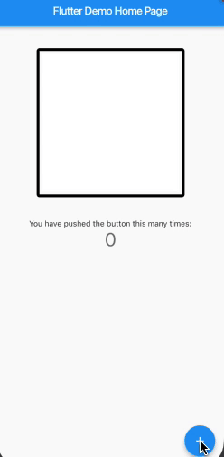

# Persistent Canvas Example

        PersistentCanvas _canvas = PersistentCanvas(
          // [PersistentCanvas] will maintain a [ui.Image] of [Size] 'size'
          size: Size(250, 250),

          // Use "normalized" coordinates spanning [0,1]
          coordinates: PersistentCanvasCoordinates.preNormalized,
        );
         
        RandomColor _randomColor = RandomColor();
        Random _random = Random();
        int _counter = 0;
         
        void _incrementCounter() {
          setState(() {
            _counter++;
         
            // Draw a random circle
            _canvas.drawCircle(
              Offset(_random.nextDouble(), _random.nextDouble()),
              _random.nextDouble() / 20.0,
              Paint()..color = _randomColor.randomColor(),
            );
          });
        }

## Demo

